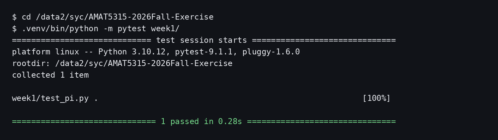

# AMAT5315 2026 Fall Exercise

This public repository records the Week 1 learning-contract exercise for
AMAT5315. It demonstrates an AI-agent workflow, an auditable Git history, and a
tested Monte Carlo estimator for pi.

## Setup

```bash
python3 -m venv .venv
. .venv/bin/activate
python -m pip install -r requirements.txt
```

## Run the test

```bash
python -m pytest week1/
```

The implementation uses a private seeded random-number generator, so equal
inputs are repeatable without changing Python's global random state.

## Test evidence



Screen-reader description: A terminal in `/data2/syc/AMAT5315-2026Fall-Exercise`
runs `.venv/bin/python -m pytest week1/` and reports that one test passed.

## Repository memory and tutor

Project conventions are recorded in `AGENTS.md`. The project-level `tutor`
skill is stored in `.agents/skills/tutor/SKILL.md` and teaches lesson material
one checkpoint at a time.

Repository: https://github.com/helpscott/AMAT5315-2026Fall-Exercise

