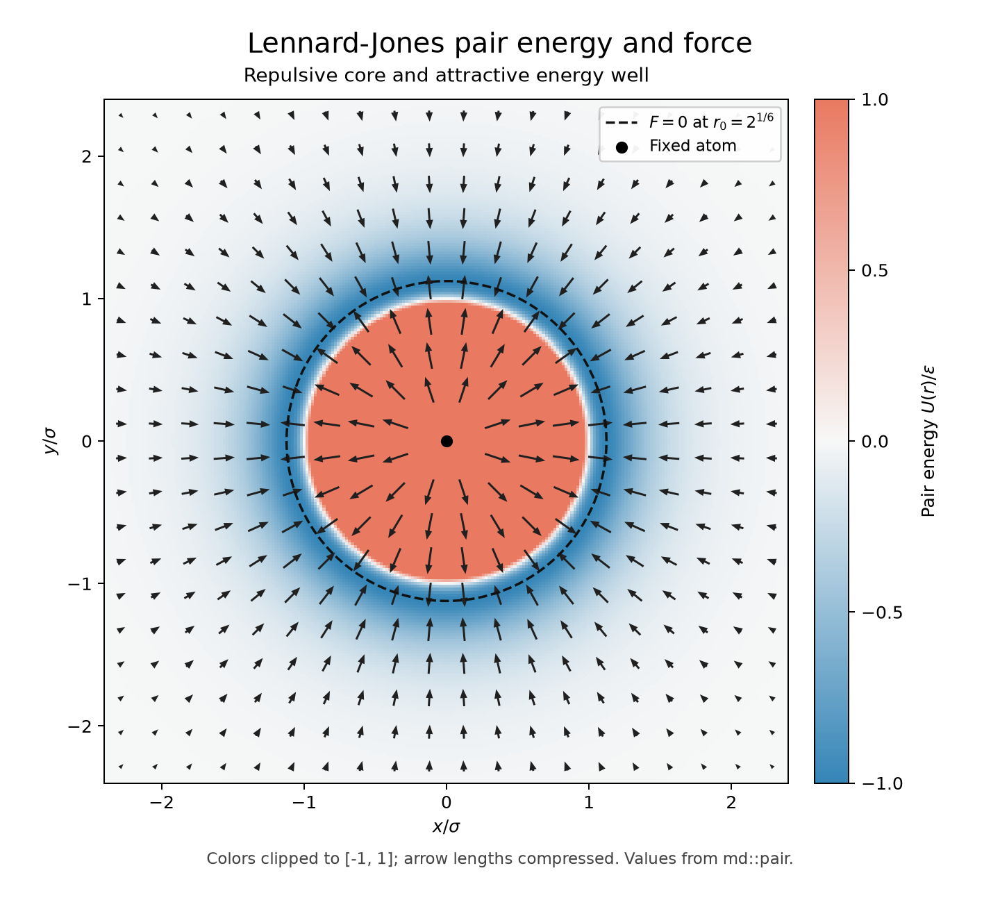

# Week 2: Agentic coding with Rust

## Part 1: Rust ABC

The `md` crate contains a library and an executable. The executable and the
unit test both call `greeting()` from `md/src/lib.rs`.

From the repository root:

```bash
cd week2/md
cargo run
cargo test --lib
```

At the Part 1 checkpoint, the expected output was `Hello, world!` and
`1 passed; 0 failed`. Later stages add tests to the same crate.

- `md/Cargo.toml`: package metadata and dependencies.
- `md/src/lib.rs`: the shared greeting function and its unit test.
- `md/src/main.rs`: the command-line entry point, which prints the greeting.
- `md/Cargo.lock`: the locked dependency graph, committed for reproducibility.

This first stage uses only the Rust standard library. Build output under
`md/target/` is excluded from Git. The molecular-dynamics implementation will
extend this same crate in later stages.

After verifying Part 1, return to `week2/` with `cd ..`. Later Cargo commands
run there with `--manifest-path md/Cargo.toml`.

## Part 2: Pair energy and force

For a positive separation `r`, in reduced units:

- Energy: `U(r) = 4 * (r^(-12) - r^(-6))`.
- Radial force: `F(r) = 24/r * (2*r^(-12) - r^(-6))`.
- The minimum is at `r0 = 2^(1/6)`, approximately 1.12246, with `U(r0) = -1`.
- A positive radial force means repulsion; a negative one means attraction.

Both functions live in `md/src/pair.rs`. These are the plain, uncut
Lennard-Jones functions. The force has its own analytical formula and does not
call the energy function. To obtain the vector force on a particle at `(x, y)`
relative to an atom at the origin, multiply `F(r)` by `(x/r, y/r)`.

The unit tests in `md/src/pair/tests.rs` independently compare this force with
`-(U(r+h) - U(r-h))/(2*h)`, using `h = 1e-5` and absolute tolerance
`1e-6 * max(1, abs(F(r)))`. The nine separations are 0.9, 1.0, 1.1, r0, 1.2,
1.5, 2.0, 2.5, and 3.0, covering both sides of r0. The well-depth test fixes
the energy scale to an absolute tolerance of `1e-12`.

The instructional history preserves the tests unchanged:

| Commit | Change | Library test result |
| --- | --- | --- |
| `f185eb2` | Add two tests and unimplemented functions | 1 passed, 2 failed |
| `8ff5a78` | Implement energy | 2 passed, 1 failed |
| `98c1b0c` | Implement analytical force | 3 passed, 0 failed |

From `week2/`, run the current checks:

```bash
cargo test --manifest-path md/Cargo.toml
```

### Reproduce the field plot

The plotting environment was tested with Python 3.13.11 and Rust 1.98.1.
Create the Python environment once (it is ignored by Git):

```bash
python3 -m venv .venv
.venv/bin/python -m pip install -r requirements-plot.txt
```

Then generate the figure from `week2/`:

```bash
.venv/bin/python plot_field.py
```

This command builds and runs the Rust `field` example in release mode.
`md/examples/field.rs` samples a 241 by 241 grid by calling the tested library
functions and writes the energies and vector forces as CSV to the plotting
script. Python only renders those data; it does not contain a second pair
potential or force formula. The singular point at the origin is masked.



Colors show potential energy, clipped to [-1, 1]. Arrow lengths are compressed
monotonically for visibility, preserving their directions. The dashed circle
marks the zero-force radius r0. Verify that arrows point outward inside this
circle and inward outside it, with a blue negative-energy ring around the
red repulsive core.

Reference: `week2-learning-sheet.pdf`, Part 2, pages 4-6, equations (1)-(2)
and the central-difference test specification.
